# Food Parcel - Frontend
This is the Frontend service of Food Parcel app. This repository have the code related to User interfaces, API integrations, etc

## This application is developed using
- Next JS
- TypeScript
- Material UI
- Tailwind CSS
- Redux Toolkit
- Yup validation (for forms validations)

## Users
1. Customers 
2. Restaurants
3. Delivery Agents

### Application Flow
1. User has to create an Account Creation
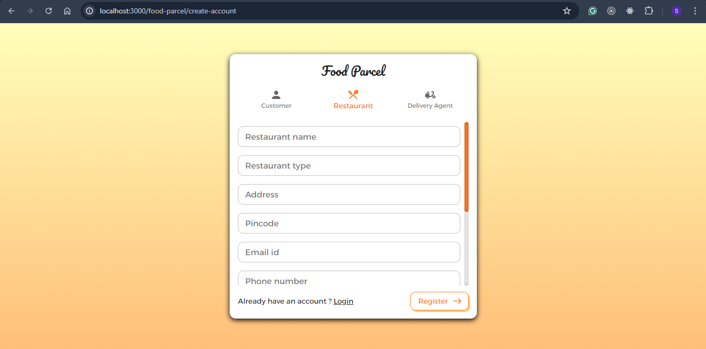

2. Once account is created successfully, user can Login by providing email id and password
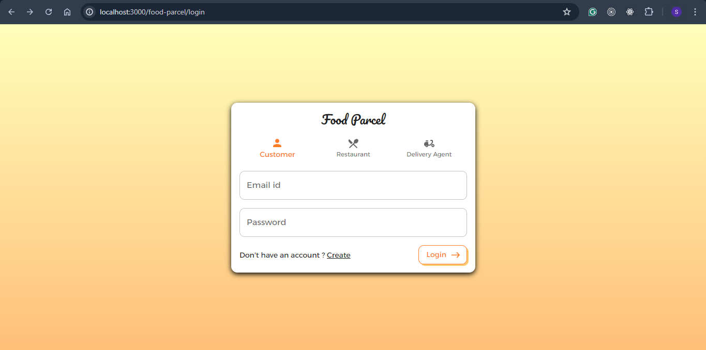

#### Customer Flow
1. Once customer is logged in, he will be landing on the home page, customer can click on anyone from the available restaurants
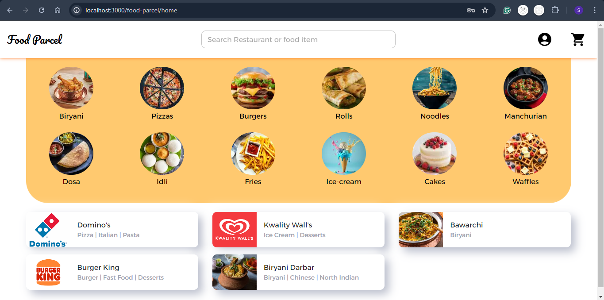

2. User can add the food items and update the quantity as per his requirement
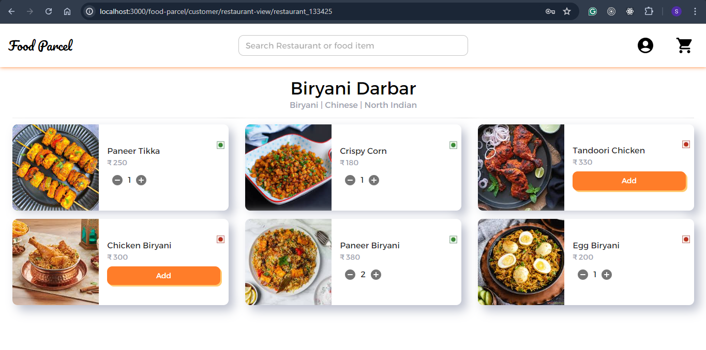

3. In the cart page we can review all the selected items and payment details
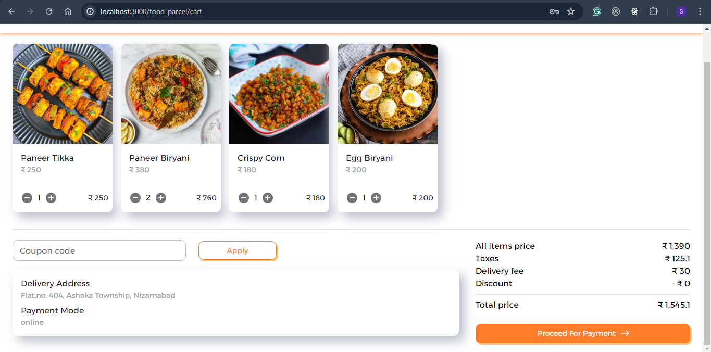

4. Once payment is done, user will be redirected to order confirmation page
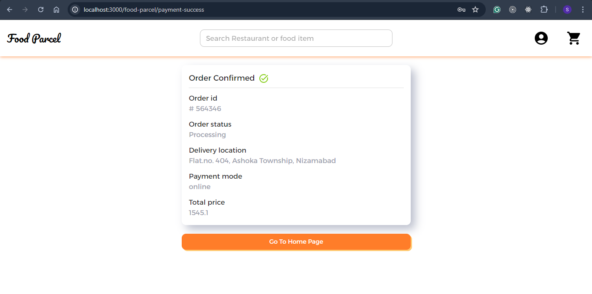

5. Customer can also checkout his my orders page to review all his current and previous order details
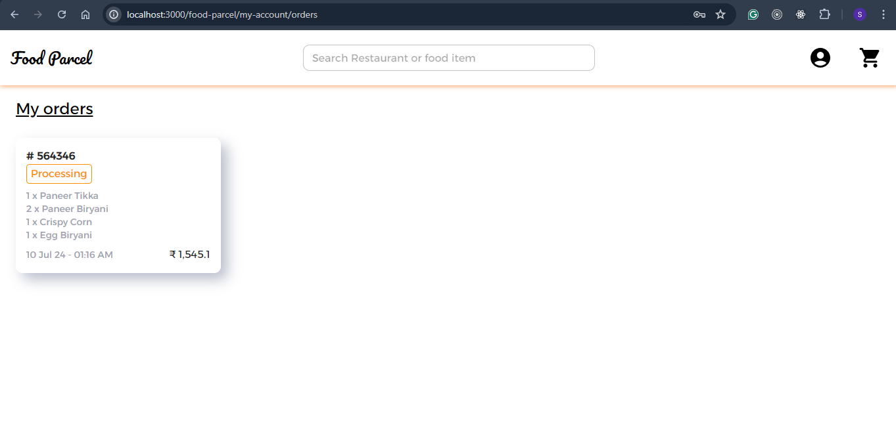

#### Restaurant Flow
1. Once Restaurant user gets logged in, he will be landing on the home page. The first part of the page is to handle the active and incoming orders
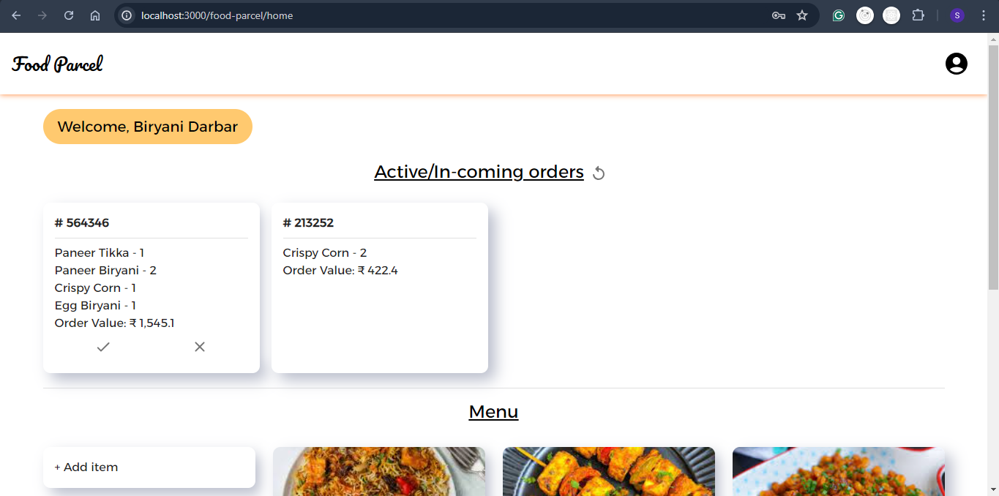

2. Second part of the page is to manage restaurant's menu
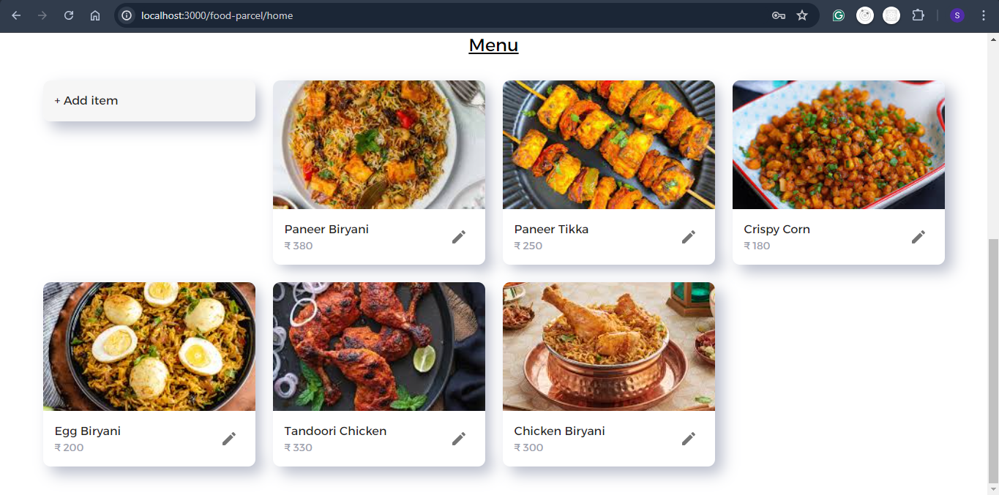

3. To add new food item in menu
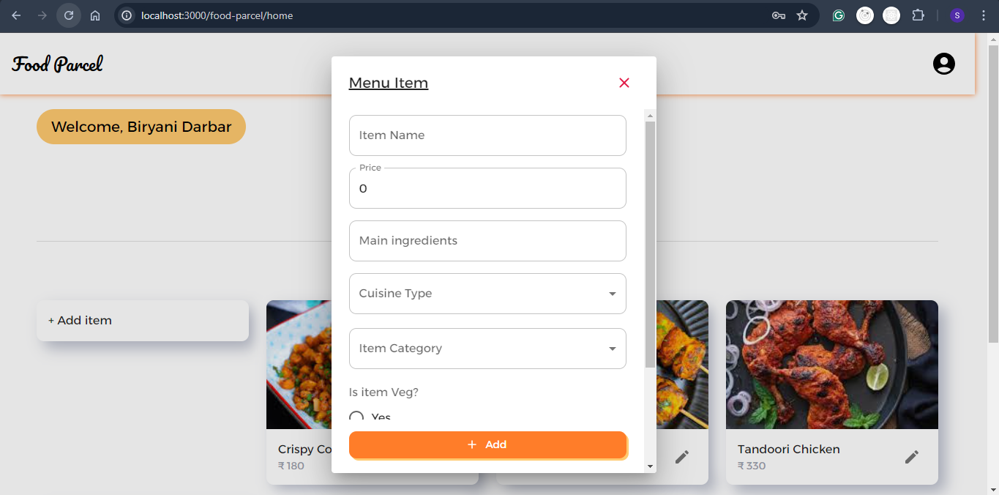

4. Update or delete existing menu item details
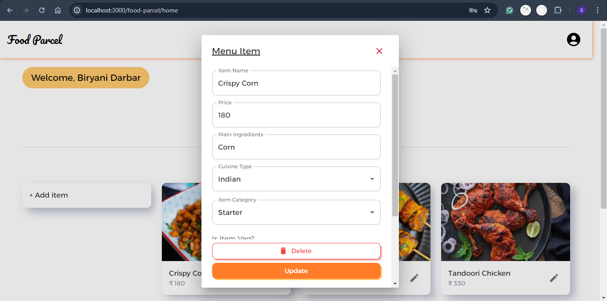

5. Restaurant's My orders page
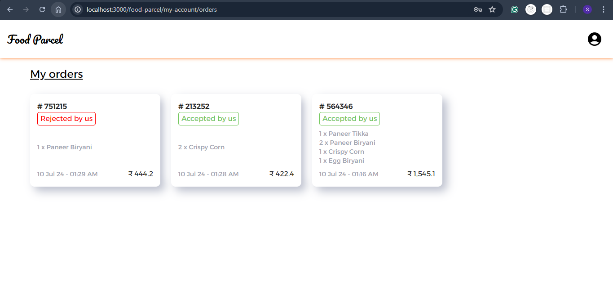

#### Delivery Agent Flow
1. Once the delivery agent logged in, he can view his earnings, current order and available orders
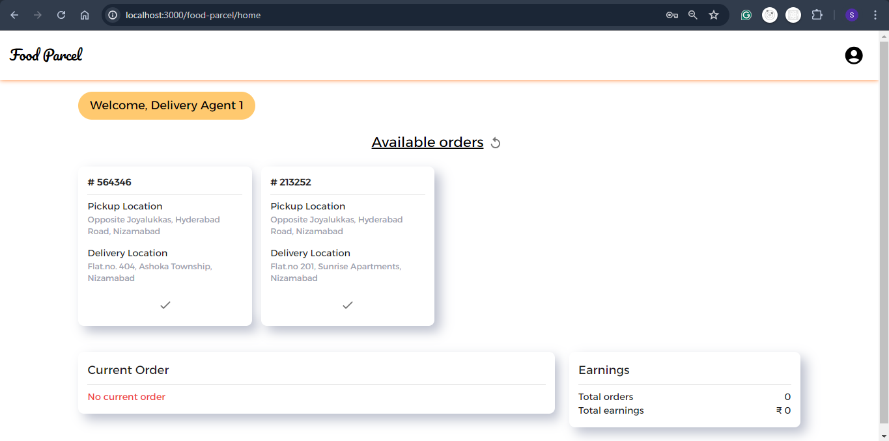

2. If the delivery agent accepts any available order, then that particular order will become his current order
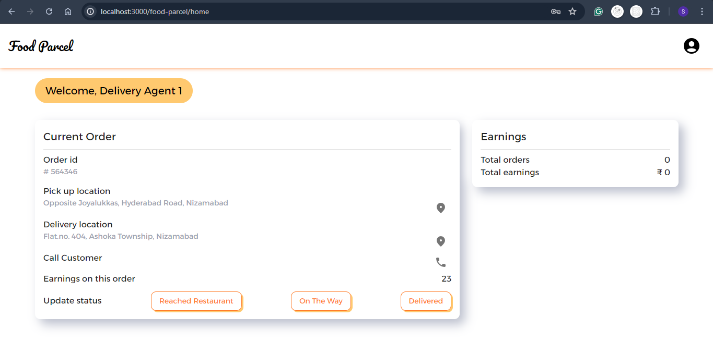

3. Agent can update the status of the order

4. My orders page of agent
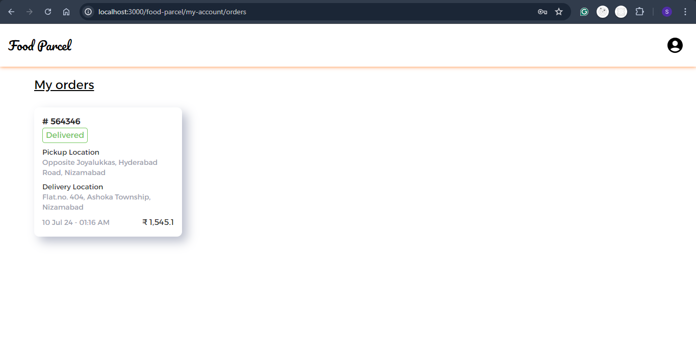

#### Additional functionalities
Below functionalities will be available for all the users
1. Delete Account
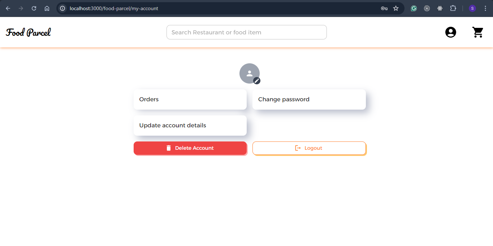

2. Change Password
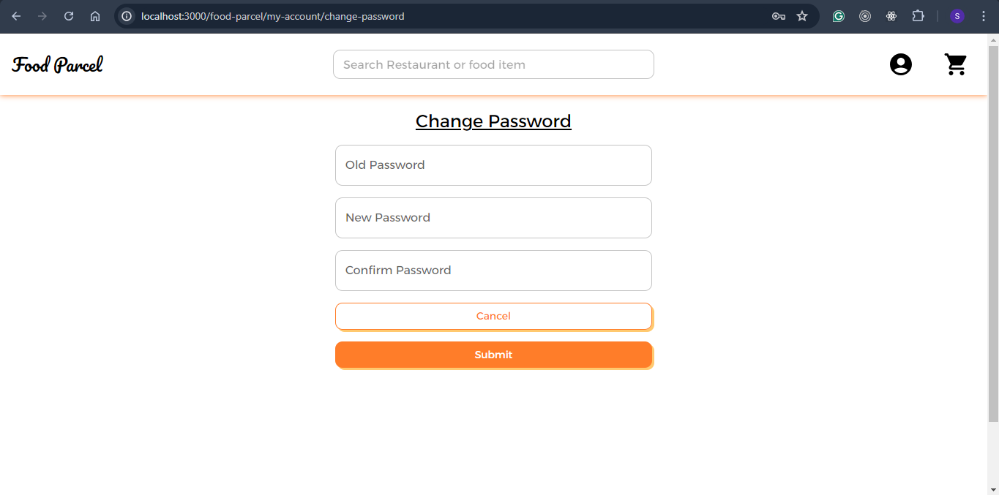

3. Update account details
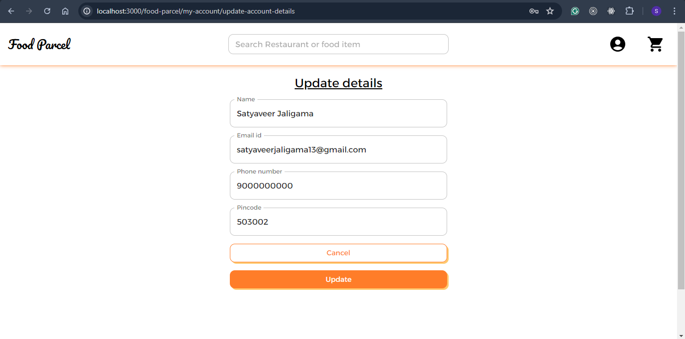

### Note
Names and images used in this application are stored in the local DB and fetched based on the requirement. The Images are taken from various parts of internet for development purposes only, and all the rights are retailned by the original owners